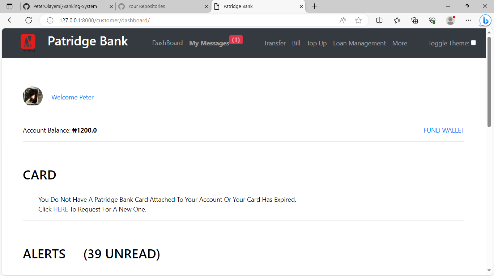
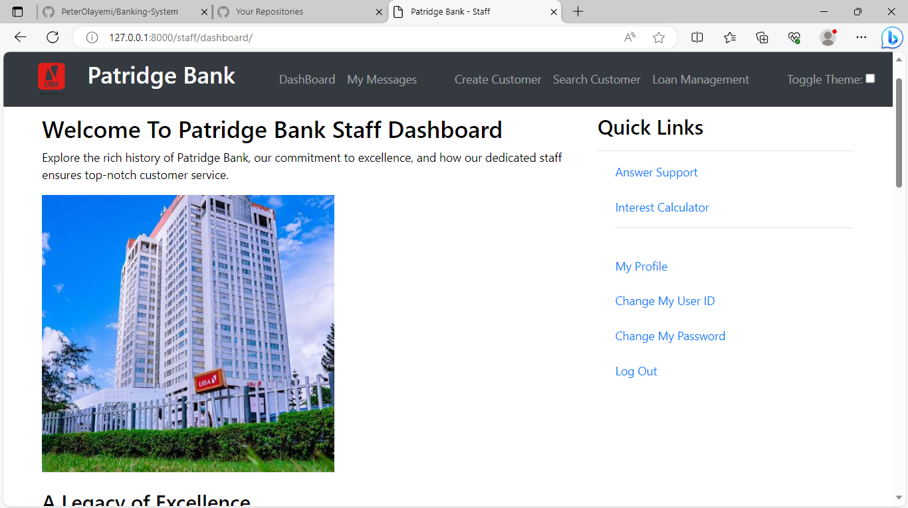
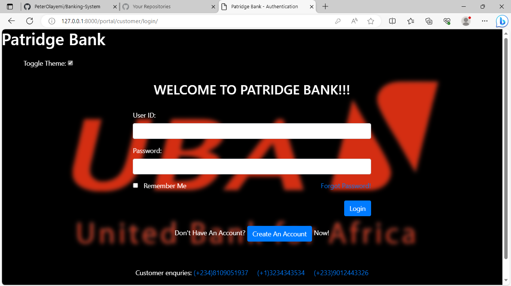
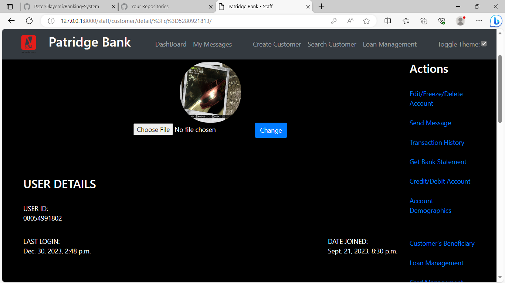
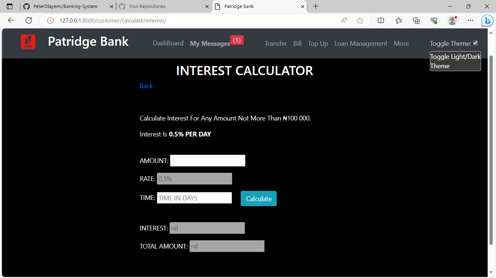

# Modern Banking Website

Welcome to the Modern Banking Website, a fully-fledged online banking platform designed with a sleek and user-friendly interface for both customer and staff. This project combines a sophisticated front-end built with HTML, CSS, Bootstrap, and JavaScript, and a robust Python Django backend.

## Features

### General Key Features

* Responsive Design: Built using Bootstrap for a seamless experience across various devices and screen sizes.
* Interactive UI: Dynamic and engaging user interface with smooth transitions and intuitive controls using JavaScript.
* Secure Backend: Django backend ensures a secure and scalable architecture for handling financial transactions and user data.
* Account Management: Users can easily create accounts, manage profiles, and perform various banking operations.
* Transaction History: Keep track of your financial activities with a detailed transaction history.
* Email Notification: Transaction alerts are provided generally on the website and if email notification is on, users are immediately notified of their transactions.
* Toggle Theme: Smooth transition between light and dark mode on the website.

### Customer Portal

- **Account Management:**
  - Easy creation of accounts.
  - Fund accounts securely using Paystack.
  - View and manage beneficiaries.
  - Daily transaction limit.
  - Get Bank Statement through direct download or email in document form.
  - Loan management with interest calculator.

- **Financial Transactions:**
  - Transfer funds between accounts.
  - Pay bills seamlessly (GOTV, DSTV, Startimes, electricity bills).
  - Purchase airtime and data.

- **Communication:**
  - Real-time chat between customers and staff for customer support.
  - View bank news.
  - View bank exchange rates.

### Staff Portal

- **Customer Interaction:**
  - Communicate with customers through a secure chat interface.
  - Perform all transactions on behalf of customers.

- **Financial Management:**
  - Process fund transfers, bill payments, airtime, and data purchases.
  - Account funding and management.
  - View customer account demographics.

- **Bank Operations:**
  - Generate and retrieve customer bank statements.
  - Manage daily transaction limits.
  - Loan processing with interest calculator.

- **Notifications and Alerts:**
  - Set up and customize email notification preferences.
  - Transaction alerts via both the website and email.

### Additional Features

- **Security:**
  - User authentication and authorization.
  - Secure payment transactions through Paystack.

- **Documentation:**
  - Comprehensive documentation in the `docs` directory for setup and customization.

## Technologies Used

- **Frontend:** HTML, CSS, Bootstrap, JavaScript
- **Backend:** Python Django
- **Database:** SQLite (can be easily configured for other databases)
- **APIs:** Paystack - For payment processing; MobileNig - For top-up and bill payments
- **Deployment:** 

## Getting Started

### 1. Clone the repository:
    git clone https://github.com/PeterOlayemi/Banking-System.git

### 2. Install dependencies:
    pip install -r requirements.txt

### 3: Migrate server:
    python manage.py makemigrations
    python manage.py migrate

### 4: Run the development server:
    python manage.py runserver

### 5: Access the application at http://localhost:8000 in your browser.

## Screenshots
- Customer Dashboard:

- Staff Dashboard:

- Customer Login Page in Dark Mode:

- Staff: Customer Account Management in Dark Mode

- Interest Calculator:

## Contributing
Feel free to contribute by submitting issues or pull requests.

## License
This project is licensed under the [MIT License](LICENSE) - see the [LICENSE](LICENSE) file for details.

# Where to find Me
[Visit My Website](https://peterolayemi.github.io)
